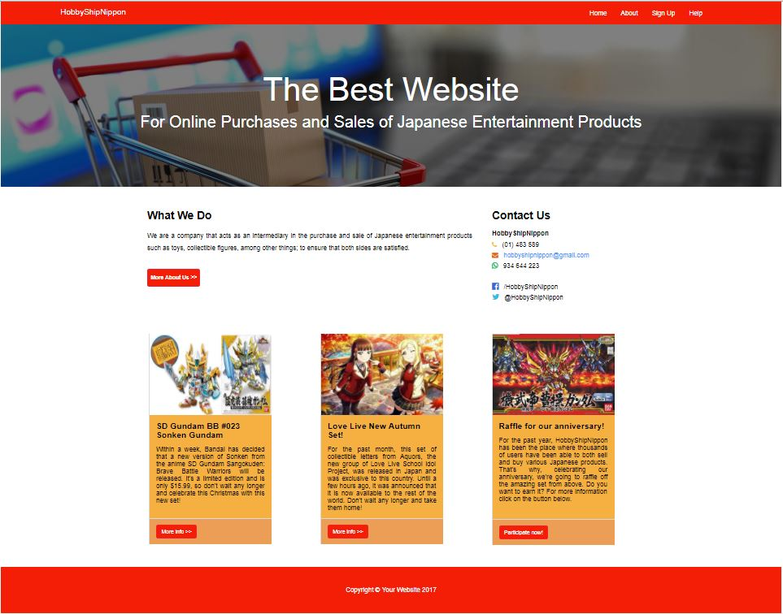

# **Mi página**

## **Objetivo**

El objetivo de este reto es realizar una página a nuestro gusto, usando lo aprendido sobre Diseño Web Responsive, Media Queries, Viewport y Grid System.

## **A tener en cuenta**

* Si bien ha sido permitido tomar libertades con respecto al diseño,se debe  mantener la estructura de la página.
* Además, debe realizarse con un grid (cualquiera pero que no sea un framework como Bootstrap o Materialize).

## **Estructura de la Página Web**

La estructura de la página es la siguiente:

* En desktops y laptops:

* En móviles:

### **Nota**

* Si bien este es el wireframe, hay ciertas cosas, como por el ejemplo el relleno(padding) del pie de página, el borde del ícono del menú hamburguesa o los íconos coloridos de la parte de Contact us que son diferentes. Esto ha sido así principalmente, debido a que se les enseñó el sitio web a algunos usuarios y se tomó en cuenta sus sugerencias. Gracias a ello, se pudo lograr este producto.
